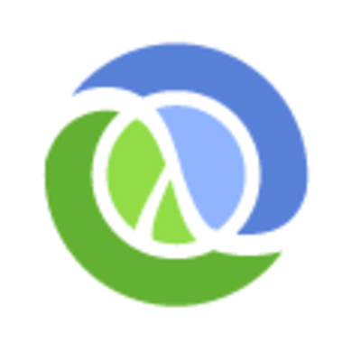
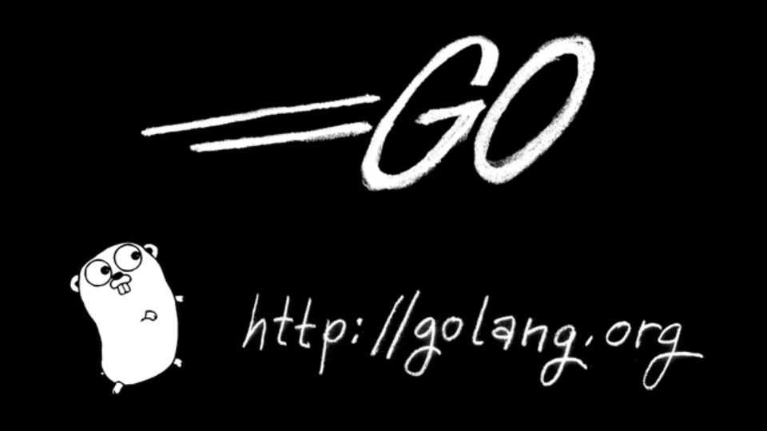

# Learn Go by Writing REST APIs

---

# Miki Tebeka 

CEO, CTO, UFO ...

### [353solutions][353]

miki@353solutions.com @tebeka

[353]: https://www.353solutions.com

---

## Personal Journey

* [The Free Lunch is Over][free-lunch]
* [The C10K Problem][c10k]

[free-lunch]: http://www.gotw.ca/publications/concurrency-ddj.htm
[c10k]: https://en.wikipedia.org/wiki/C10k_problem

---

# And the Winner Was ...

---

---

# However ...

---

# JVM

1,000,000 things I hate about you

---

---

## Some Background

* Developed at Google in 2009
    - Robert Griesemer, Rob Pike, and Ken Thompson
* Go 1 March 2012
    - Currently at 1.9.2
* Notable Users/Projects
    - Google (dl.google.com, vitess, grumpy)
    - Docker, Kubernetes
    - Dropbox
    - Facebook
    - Netflix

---

## Why Go? [1]

* Built for modern hardware
* Works for small and large projects
* Small & simple language
* Static typed yet feels dynamic
* GC
* Easy integration with C/C++

---

## Why Go? [2]

* Compiles to static executable
* Fast compilation
* The `go` tool
    - And many others
* Stable API
* Great community

---

# Workshop

We'll build an in-memory key/value HTTP server

(à la [redis][redis]/[memcached][memcached])

[memcached]: https://memcached.org/
[redis]: https://redis.io/

---

### https://github.com/353solutions/learn-go-by-writing-rest-apis

---

# Let's Roll

